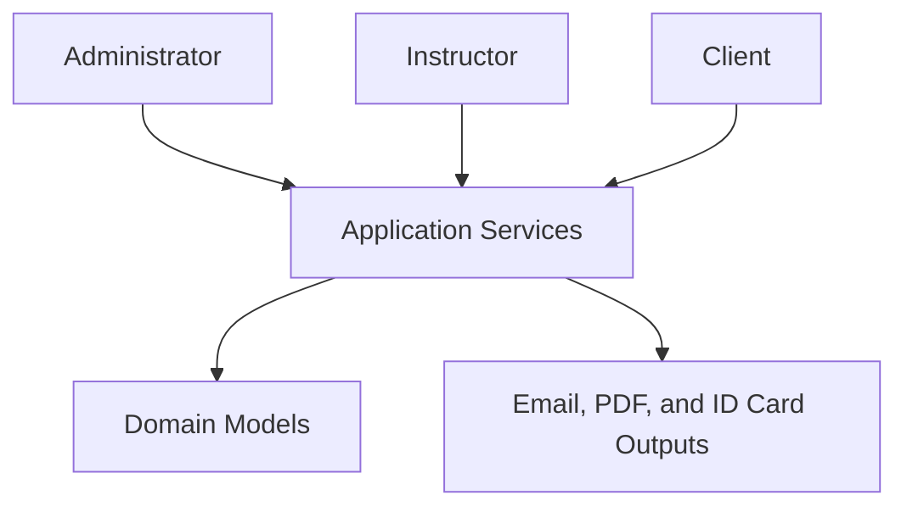

# E-M Gaza Fitness Gym Management System

[](https://openjdk.org/)
[](https://maven.apache.org/)
[](#testing-and-quality)
[](./.github/workflows/build.yml)

A role-based gym management system developed as a university Software Engineering project. The system models the main workflows of a fitness organization for administrators, instructors, and clients, with an emphasis on object-oriented design, behavior-driven development, automated testing, and continuous integration.

## Project Highlights

- Role-based workflows for administrators, instructors, and clients.
- Fitness-program creation, exploration, enrollment, and scheduling.
- Client progress and attendance tracking.
- Membership and subscription-plan management.
- Feedback, suggestions, wellness articles, and approval workflows.
- PDF report generation and membership ID-card creation.
- Email notifications with attachment support.
- Unit testing with JUnit and behavior-driven testing with Cucumber.
- Code coverage through JaCoCo and analysis through SonarCloud.
- Automated Maven builds using GitHub Actions.
- Class-model documentation using PlantUML.

## Core Features

| Role | Main Capabilities |
| --- | --- |
| **Administrator** | Manage users, approve registrations, activate or deactivate accounts, assign subscription plans, review feedback and articles, inspect activity statistics, and generate reports. |
| **Instructor** | Create and update fitness programs, schedule group sessions, track client progress, communicate with enrolled clients, and publish announcements or offers. |
| **Client** | Create an account, browse and enroll in fitness programs, track progress, submit feedback and suggestions, and view approved content. |

## Architecture Overview



Application data is managed through Java collections, keeping the project focused on domain modeling, business rules, and software-testing practices without requiring an external database.

## Technology Stack

| Area | Technologies |
| --- | --- |
| Language | Java |
| Build and dependency management | Apache Maven |
| Unit testing | JUnit 4 |
| Behavior-driven development | Cucumber and Gherkin |
| Code coverage | JaCoCo |
| Static analysis | SonarCloud |
| Continuous integration | GitHub Actions |
| PDF generation | iText |
| Email integration | Apache Commons Email |
| Software modeling | PlantUML |

## Project Structure

```text
.
├── .github/workflows/               # CI and SonarCloud workflows
├── softwareProj/
│   ├── Admin_Features/              # Administrator Gherkin scenarios
│   ├── Client_Features/             # Client Gherkin scenarios
│   ├── Instructor_Features/         # Instructor Gherkin scenarios
│   ├── GeneratedRe/                 # Generated membership ID cards
│   ├── GeneratedReports/            # Generated PDF reports
│   ├── src/main/java/softwareProj/  # Application and domain classes
│   ├── src/test/java/softwareProj/  # Tests and Cucumber step definitions
│   ├── SofPProjUML.puml             # PlantUML class model
│   └── pom.xml                      # Maven project configuration
└── README.md
```

## Getting Started

### Prerequisites

- JDK 17 or later
- Apache Maven 3.8 or later
- Git

### Clone the Repository

```bash
git clone https://github.com/AhmadAdas21/gym-management-system.git
cd gym-management-system/softwareProj
```

### Install Dependencies and Run Tests

```bash
mvn clean test
```

### Generate the Coverage Report

```bash
mvn clean test jacoco:report
```

The generated JaCoCo report can be opened from:

```text
softwareProj/target/site/jacoco/index.html
```

> This repository primarily demonstrates the domain implementation and automated test suite. Interactive console prototypes are preserved in `MainClass.java` and `MainClassClient.java`, but are currently commented out.

## Testing and Quality

The project combines two complementary testing approaches:

- **JUnit:** tests the domain models, managers, validation rules, progress calculations, reporting, and generated artifacts.
- **Cucumber:** describes and verifies role-based workflows through readable Gherkin scenarios.

GitHub Actions runs the Maven test suite on repository changes. A separate workflow supports JaCoCo coverage reporting and SonarCloud analysis.

## Domain Model

The PlantUML class model is available at [`softwareProj/SofPProjUML.puml`](./softwareProj/SofPProjUML.puml). It documents the relationships among users, accounts, instructors, clients, programs, schedules, progress records, feedback, suggestions, articles, reports, and membership cards.

## Academic Context

This project was developed collaboratively by a three-student team as part of a university Software Engineering course at An-Najah National University. It demonstrates practical experience with requirements modeling, object-oriented programming, behavior-driven development, unit testing, code coverage, continuous integration, and collaborative Git workflows.

## Future Improvements

- Enable and refine the interactive command-line entry point.
- Add persistent storage through a relational database.
- Hash user passwords and introduce a dedicated authentication layer.
- Move configuration and credentials to environment variables.
- Replace console workflows with a REST API or graphical interface.
- Mock external email delivery in automated tests.
- Standardize Java naming and package conventions.

## Contributors

Developed by a three-member student team at An-Najah National University.
